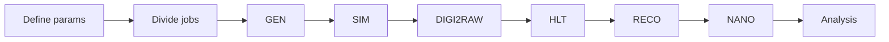
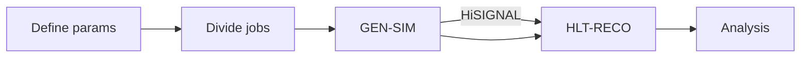

+++
title = "Introduction"
weight = 10
teaching = 10
questions = ["What does this workflow do?", "Who is this workflow for?"]
objectives = ["Understand what the workflow does and who is it for."]
keypoints = ["With this workflow you can create a simulated dataset.", "Because the data processing requires a lot of resources, here we use public cloud resources."]
+++

## About the workflow

The goal of this workflow is to use public cloud resources, here Infomaniak resources, to process data following certain steps, and ultimately produce a simulated dataset ready for data analysis.

## Why public cloud?

Data processing can, in theory, be done with

- Institute's resources
- Local resources i.e. your own computer
- Public resources

This tutorial shows how to create a simulated dataset without access to private resources and only using the public cloud resources. Infomaniak is an affordable Switzerland based cloud provider, whose resources we will be using throughout this tutorial.

## The Steps in a Full Simulation Workflow

### Proton-proton simulation

Proton-proton simulation follows such steps:

This workflow is completed by running the `run-pp-simulation.yaml` file. In that file there are a few parameters, that the user needs to define.

- **bucket:** the name of your OpenStack Object Storage
- **dataName:** the name of the directory you want your dataset in
- **fragFileName:** the name you give to the data fragment when copying it to the Object Storage
- **totEvents:** the total amount of events in the dataset. Defines the number of jobs.
- **runYear:** the year of the Run you want to simulate. Defines e.g. the conditions and beamspots of the simulations.

### Heavy ion simulation

Heavy ion simulation, on the other hand, is completed as such:

... meaning that some datasets have the HiSIGNAL step and some don't. If you want to run the HiSIGNAL step in your workflow, you will have to modify the parameters in the file `run-heavy-ion-simulation.yaml`. 

- **bucket:** the name of your OpenStack Object Storage
- **dataName:** the name of the directory you want your dataset in
- **fragFileName:** the name you give to the data fragment when copying it to the Object Storage
- **totEvents:** the total amount of events in the dataset. Defines the number of jobs.
- **runYear:** the year of the Run you want to simulate. Defines e.g. the conditions and beamspots of the simulations.

More information about running and editing the yaml files is in the next chapter.


To get an Infomaniak Kubernetes cluster and Argo installed on it, follow the [Setup]({{ < relref "/learners/setup/" >}})


After you have completed the prerequisites, you can continue.

