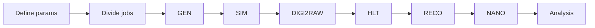

+++
title = "Introduction"
weight = 10
teaching = 10
questions = ["What does this workflow do?", "Who is this workflow for?"]
objectives = ["Understand what the workflow does and who is it for."]
keypoints = ["With this workflow you can create a simulated dataset.", "Because the data processing requires a lot of resources, here we use public cloud resources."]
+++

## Objective

The goal of this workflow is to offer an alternative for scientists outside of CERN to use the CMS software for data processing. In this tutorial you will learn to run a workflow that simulates a collision dataset based on parameters given by the user. This is done using public cloud resources, here specifically cloud resources by Infomaniak, a Swiss cloud provider.

## Steps of the Full Simulation Workflow

Proton-proton simulation follows the workflow as presented below:

This workflow is completed by running the `run-pp-simulation.yaml` file using the Argo Workflows CLI. This file contains the all of the workflow logic, including the parameters that the user should set before a run:

- `bucket` - the name of your OpenStack Object Storage
- `dataName` - the name of the directory the dataset will be saved in
- `fragFileName` - the name you give to the data fragment when copying it to the Object Storage
- `totEvents` - the total amount of events in the dataset. Defines the number of jobs.
- `runYear` - the year of the Run you want to simulate. Defines e.g. the conditions and beamspots of the simulations.

The workflow can be found in the GitHub repository [FullSimulationArgoWorkflow](https://github.com/cms-opendata-processing-tasks/FullSimulationArgoWorkflow).


The workflow repository also includes another file `run-heavy-ion-simulation.yaml` for heavy-ion simulation purposes. This will not be covered in this tutorial. Instead read the `README.md` for that directory.


More information about running and editing the yaml files is in the next chapter.

