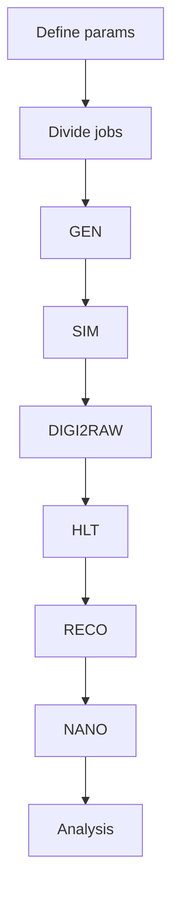
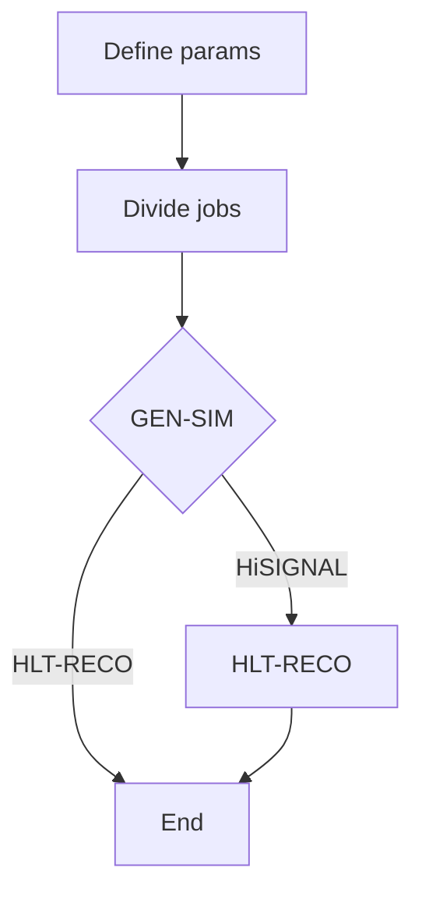

+++
title = "Introduction"
weight = 10
teaching = 10
exercises = 10
questions = ["How to use Argo?", "What does this workflow do?"]
objectives = ["Understand what the workflow does and who is it for."]
keypoints = ["With this workflow you can create a simulated dataset.", "Because the data processing requires a lot of resources, here we use public cloud resources."]
+++

# About the workflow

The goal of this workflow is to use public cloud resources, here Infomaniak resources, to process data following certain steps, and ultimately produce a simulated dataset ready for data analysis.

# Why public cloud?

Data processing can, in theory, be done with

- Institute's resources
- Local resources i.e. your own computer
- Public resources

This tutorial shows how to create a simulated dataset without access to private resources and only using the public cloud resources. Infomaniak is an affordable Switzerland based cloud provider, whose resources we will be using throughout this tutorial.

# Full Simulation Workflow

### Prerequisites

To get an Infomaniak Kubernetes cluster and Argo setup on it, follow this [Setup tutorial](https://cms-opendata-workshop.github.io/tutorial-lesson-cloud-processing-infomaniak/)

### Workflow steps

#### Proton-proton simulation

Proton-proton simulation follows such steps:



This workflow is completed by running the `run-pp-simulation.yaml` file. More on that in the next chapter.

#### Heavy ion simulation

Heavy ion simulation, on the other hand, is completed as such:



Heavy ion simulation is in the file `run-heavy-ion-simulation.yaml`. Running the .yaml files is done in chapter xx.

## 1. Run setup checks first

Before editing content, confirm your toolchain from the
[Setup]() page.

Then run:

```bash
hugo version
hugo server
```

This works without Go because the template commits a vendored module tree in `_vendor/`.

If setup is unclear, use the shared docs:

- [hugo-styles Quickstart](https://oer-particle-physics.github.io/hugo-styles/docs/quickstart/)
- [hugo-styles Troubleshooting](https://oer-particle-physics.github.io/hugo-styles/docs/troubleshooting/)

## 2. Update `hugo.toml` early

Edit these fields before replacing episode content:

| Field                                       | Why it matters                                                                                            |
| ------------------------------------------- | --------------------------------------------------------------------------------------------------------- |
| `baseURL`                                   | Production URL for deployed pages and canonical links, for example `https://<account>.github.io/<repo>/`. |
| top-level `title`                           | Site title used in browser/title surfaces.                                                                |
| `[params.lesson].title`                     | Lesson title shown in theme components.                                                                   |
| `[params.lesson].tagline` and `description` | Homepage framing and metadata summary.                                                                    |
| `[params.lesson].contact`                   | Contact shown in lesson metadata contexts.                                                                |
| `[params.lesson].repo`                      | Footer source link target in the UI.                                                                      |
| `[params.lesson].editBranch`                | Branch used for “Edit this page” links.                                                                   |
| `[params.versioning]`                       | Controls whether the deployment workflow publishes only `Latest` or also archived branch/tag builds.      |
| `[[menus.main]]` GitHub `url`               | Top-nav GitHub link target.                                                                               |

If you plan to deploy on GitHub Pages, enable Pages in the repository settings and choose
`GitHub Actions` as the source before the first push to `main`.
The included workflow deploys on pushes to `main`, so that first push should already have a configured Pages target.


Do not remove the `module.imports` block that points to `github.com/oer-particle-physics/hugo-styles`.
That import is what provides the shared layouts, shortcodes, and supporting behavior.

