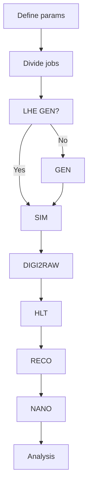

+++
title = "Introduction"
weight = 10
teaching = 10
questions = ["What does this workflow do?", "Who is this workflow for?"]
objectives = ["Understand what the workflow does and who is it for."]
keypoints = ["This workflow can create a simulated collision dataset.", "Because the data processing requires a lot of resources, in this tutorial we use public cloud providers."]
+++

## Objective

The goal of this workflow is to offer an opportunity for scientists outside of CERN to efficiently use the CMS software for data processing. In this tutorial you will learn how to run a workflow that simulates a collision dataset based on parameters given by the user. To get the workflow running on a cloud provider's resources, you need an account to some cloud provider's services. In this tutorial we use Infomaniak, a Swiss reasonably-priced cloud provider.

## Steps of the Full Simulation Workflow

The workflow, which you can find on [GitHub](https://github.com/cms-opendata-processing-tasks/FullSimulationArgoWorkflow), follows these steps:

As you can see in the flow chart, if the user has chosen to do the event generation using the LHE standard format, the workflow skips the GEN step. This is because the user is expected to do the LHE event generation before hand and use the files from that step as input files for this workflow.

The workflow logic can be found in the file `cms-simulation-process/run-pp-simulation.yaml`. There you can find also the different parameters, which should be edited according to your situation.

The parameters are:

- `bucket` - the name of your OpenStack Object Storage
- `dataName` - the name of the directory the dataset will be saved in
- `fragFileName` - the name you give to the data fragment when copying it to the Object Storage
- `totEvents` - the total amount of events in the dataset. Defines the number of jobs.
- `runYear` - the year of the Run you want to simulate. Defines e.g. the conditions and beamspots of the simulations.

More information about running and editing the yaml files is in the next chapter.


The workflow repository also includes another file `run-heavy-ion-simulation.yaml` for heavy-ion simulation purposes. This will not be covered in this tutorial. Instead, if you want to run the heavy-ion workflow, read the `README.md` for that directory.


