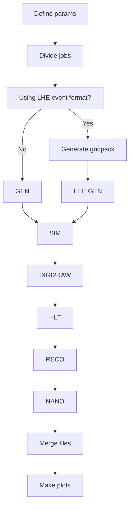

+++
title = "Introduction"
weight = 10
teaching = 10
questions = ["How does the workflow create a dataset from a data fragment?", "Who is this workflow for?"]
objectives = ["Get an overview of what steps the workflow contains.", "Understand what tools are used for the actual data processing."]
keypoints = ["This workflow runs automatically the steps of proton-proton collision dataset simulation with 2016 run conditions.", "Because the data processing requires a lot of resources, in this tutorial we use public cloud providers.", "The workflow is customised to your needs by editing the parameters in the workflow yaml file."]
+++

## Objective of the Workflow

The goal of this workflow is to offer an opportunity for scientists outside of CERN to efficiently use the CMS software for data processing. In this tutorial you will learn how to run a workflow that simulates a collision dataset based on parameters given by the user. To get the workflow running on a cloud provider's resources, you need an account to some cloud provider's services. In this tutorial we use Infomaniak, a Swiss reasonably-priced cloud provider.

The automated workflow used in this tutorial has been tailored specifically for proton-proton collisions using Run 2016 condition data.

## What tools does the workflow use?

The workflow is configured using the Argo Workflows CLI. It is a tool for running workflows in a Kubernetes cluster. The `kubectl` command line tool is used to setup the cluster before running the workflows.

The CMS software, CMSSW, is the core of this workflow. Every data processing step consists of a `cmsDriver.py` command and a `cmsRun` command which are run in a container. Usually some preparations are needed in the software container before running these commands, but the two commands form the actual data processing of the workflow.

And finally to manage the storage used in the cloud environment, the project uses OpenStack and accesses it with the `swift` command line tool. 

Learn more about these tools behind these links:
- [Argo Workflows](https://argo-workflows.readthedocs.io/en/latest/walk-through/argo-cli/)
- [Kubectl](https://kubernetes.io/docs/reference/kubectl/)
- [CMSSW](https://cms-sw.github.io/index.html)
- [OpenStack](https://www.openstack.org/software/)

## Steps of the Full Simulation Workflow

The workflow, which you can find on [GitHub](https://github.com/cms-opendata-processing-tasks/FullSimulationArgoWorkflow), follows these steps:

The structure of this workflow is based on the CMS Monte Carlo production. Read more about this Monte Carlo simulating in CMS from the [CERN Open Data Portal](https://opendata.cern.ch/docs/cms-mc-production-overview).

The workflow can be roughly divided into preliminary steps (define parameters, divide jobs, etc.), the actual data processing (GEN, SIM, RECO, etc.) and finishing steps (merge files, example plots, etc.).

The first data processing step, the GEN, can be done in two ways. This depends on whether you want to use the Les Houches event format for the Monte Carlo event generation. This causes also that the LHE GEN and GEN steps need slightly different input files. This tutorial goes through both of these event generation methods and how to set up each of them.

The CMSSW has multiple event generators integrated in the software. The data fragment you provide for the workflow defines what event generator the software should use. The CMSSW supports at least Pythia, Herwig and Tauola. In August 2026 the workflow has mostly been tested using Pythia. You can read more about the CMSSW event production [in the CERN Open Data Portal](https://opendata.cern.ch/docs/cms-guide-event-production).

## Workflow contains parameters that need to be edited

The complete workflow logic can be found in the file `cms-simulation-process/run-pp-simulation.yaml`. There you can find also the different parameters, which should be edited according to your situation.

The parameters are:

- `bucket` - the name of your OpenStack Object Storage
- `dataName` - the name of the directory the dataset will be saved in
- `fragFileName` - the name you give to the data fragment when copying it to the Object Storage
- `totEvents` - the total amount of events in the dataset. Defines the number of jobs.
- `runYear` - the year of the run you want to simulate. Defines e.g. the conditions and beamspots of the simulations. Currently only value "2016" works.

More information about running and editing the yaml files is in the upcoming chapters.

## Input and output

There are different ways of inputting the starting data to the workflow. You can either simply upload a fragment, but if you are using the Les Houches event format, you also need to upload the cards to generate the gridpack. Currently, in August 2026, the gridpack generation step is not functional, so you should give an existing gridpack as the input file for the time being.

As an output the workflow sets three types of files in the object storage: first the MiniAOD format data files, then the NanoAOD and finally the output files, which are just NanoAOD but merged into larger and fewer files.

## Where are the files, that the workflow, uses stored?

The workflow uses two kinds of cloud storage:

##### Object Storage

Permanent storage for the input and output files of the storage. Remains even if the processing cluster is killed. This storage container is easily accessed through a [web interface](https://api.pub2.infomaniak.cloud) and command line, and makes uploading and downloading files simple.

You created an Object Storage in the [Setup]() first step.

##### Block Storage

The workflow needs a persistent volume, where it saves files from the intermediate steps. This is not a part of the processing nodes disk space, but adds to it by being a mountable external storage. Therefore it is possible to simulate large datasets and save multiple gigabytes of files during the workflow without filling the disk space of the node itself.

These volumes have a bigger passive cost, because the cost is determined by the volume size, not the size of the files actually stored on it. Therefore these volumes should be deleted whenever a cluster is deleted.

The files on these volumes are not easily accessible and most are even deleted during the workflow to save space in the run. If you want to inspect the files the intermediate steps produce, you should re-configure the workflow in a way, where the files of the step in question are also saved to the Object Storage and comment out their deletion.

