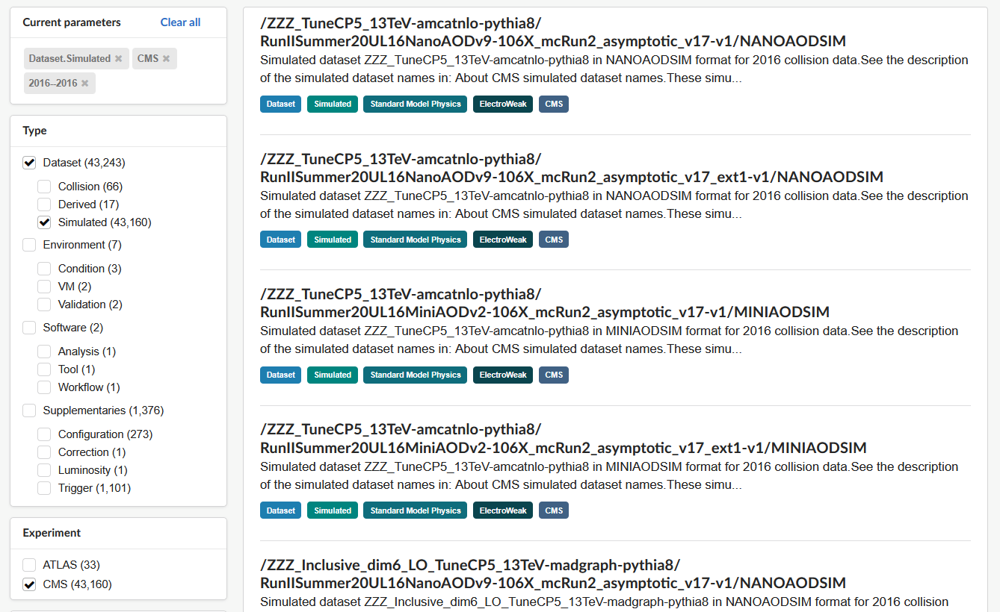
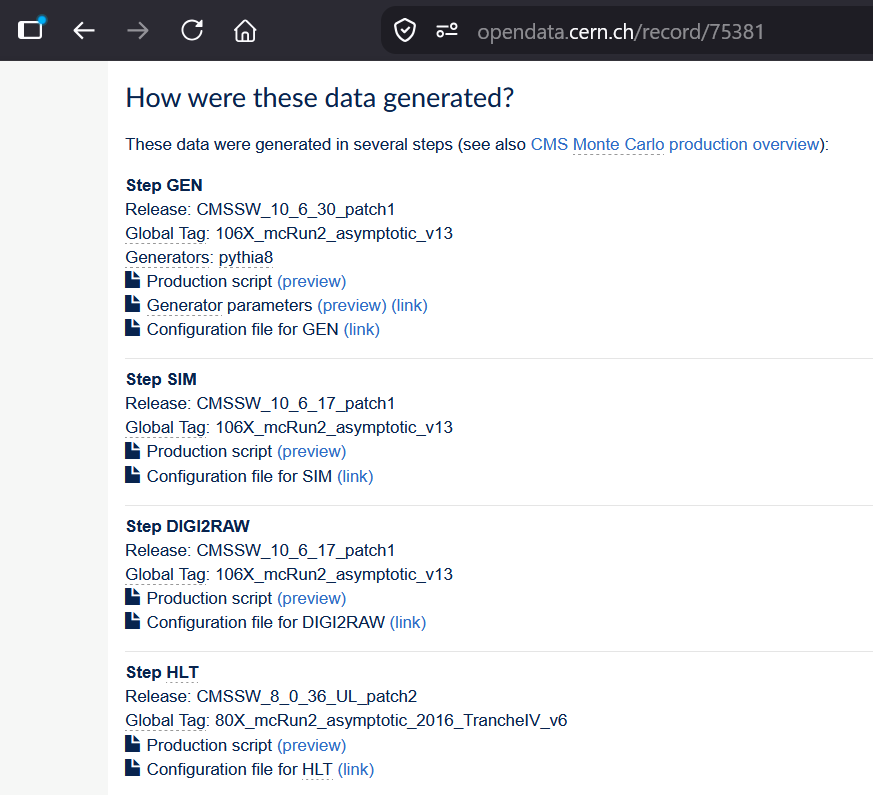
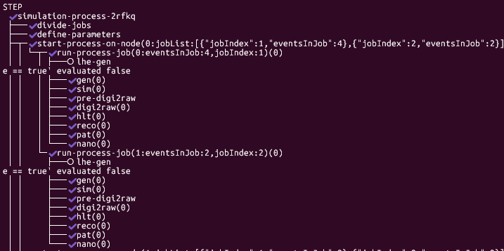

+++
title = "First Run"
weight = 20
teaching = 15
exercises = 20
questions = ["How to make the workflow run first with fewer events?", "What makes the workflow run in my environment?"]
objectives = ["Complete setting up your cloud environment.", "Run a successful workflow with a small number of events on your cluster.", "Understand what is needed from the user when running the workflow."]
keypoints = ["The workflow is run in an environment with nodes, containers and volumes.", "Before the workflow you have to upload the input file(s) to storage and create different access credentials for the nodes to communicate with the storage.", "After editing the workflow parameters, the workflow can be started with `argo submit -n argo` and monitored with `argo get @latest -n argo`"]
+++


First, complete the [Setup]() to get an Infomaniak account and order a cluster.
Once your cluster is up and running, continue the setup process.



## 1. Connect your terminal to the cluster

Choose the tab with which method you ordered your cluster.




Once the `terraform apply` has run, extract the Kubeconfig from your cluster by running:

```bash
cd <path-to-your-working-dir>
terraform output -raw kubeconfig > ./kubeconfig
```

And set it to your device's environment variables:
```bash
export KUBECONFIG=$(pwd)/kubeconfig
```

Then you should be able to connect to your cluster:
```bash
kubectl cluster-info

Kubernetes control plane is running at https://xxxxxxxx:30980
CoreDNS is running at https://xxxxxxxx/api/v1/namespaces/kube-system/services/pck-xxxxxxx-addon-coredns:udp-53/proxy

To further debug and diagnose cluster problems, use 'kubectl cluster-info dump'
```

Check that your nodes are schedulable:
```bash
kubectl get nodes
```




Once the [Manager Interface](https://manager.infomaniak.com) shows that your cluster is ready, download the Kubeconfig.

- From the sidebar navigate to Cloud Computing > Kubernetes and select your cluster
- In this view, you will see a download link "Kubeconfig" in the title box. Click on it and move the file to your working directory:

```bash
mv <path-to-downloads>/pck-xxxx-kubeconfig <path-to-working-dir>
cd <path-to-working-dir>
```

Set your Kubeconfig as an environment variable:

```bash
export KUBECONFIG=$(pwd)/pck-xxxx-kubeconfig
```

Then you should be able to connect to your cluster:
```bash
kubectl cluster-info

Kubernetes control plane is running at https://xxxxxxxx:30980
CoreDNS is running at https://xxxxxxxx/api/v1/namespaces/kube-system/services/pck-xxxxxxx-addon-coredns:udp-53/proxy

To further debug and diagnose cluster problems, use 'kubectl cluster-info dump'
```

Check that your nodes are schedulable:
```bash
kubectl get nodes
```

##### Create Block Storage volumes

When ordering the cluster from the web interface, the volumes have to be ordered seperately from the terminal:

```bash
openstack volume create --description "Volume for computing node 1" --size 15 volume_1
openstack volume create --description "Volume for computing node 2" --size 15 volume_2
```





## 2. Enable Argo for the cluster

First, create a namespace for Argo:
```bash
kubectl create ns argo
```
Install Argo Workflows to the cluster:
```bash
kubectl apply -n argo --server-side -f https://github.com/argoproj/argo-workflows/releases/download/v4.0.1/install.yaml
```
Setup the Argo service account etc. by running the configurations in the manifests folder:
```bash
kubectl apply -f manifests/
```


If you want to be able to inspect the memory and CPU usage of your cluster you have to clone another repository and run the yaml that configures the Metrics Server:
```bash
git clone https://github.com/cms-opendata-processing-tasks/WorkflowUtils.git
cd WorkflowUtils/memory_scan

kubectl apply -f components.yaml
```

After this you can run `kubectl top pods -n argo` or use on of the helper scripts in that repository, such as `./start_memory_scan.sh`.

If you want to use the latter, the instructions on how to start using the script are in the repository's [README.md](https://github.com/cms-opendata-processing-tasks/WorkflowUtils/blob/main/README.md) to set up the memory scanning script.


## 3. Give S3 credentials to the cluster

For the workflow to be able to write to the OpenStack area, the s3-credentials are set as a kubectl secret. Here you will need the `access` and `secret` values you saved in the setting up chapter.

```bash
kubectl create secret generic s3-credentials \
  --from-literal=S3_ACCESS_KEY_ID='<the value of the access field>' \
  --from-literal=S3_SECRET_ACCESS_KEY='<the value of the secret field>' \
  -n argo
```

It is useful to save this command and with it the `access` and `secret` values, to be able to use the same credentials for future clusters as well.

## 4. Configure the Persistent Volume Claims

For the workflow to be able to attach to the volumes, there needs to be a persistent volume and a persistent volume claim for each of the volumes.

First, get the block storage volumes' UUID by running

```bash
openstack volume list
```

Save the `ID` field value from each of the volumes and add it in the file `persistent_volume.yaml` to the part marked:

```yaml
## EDIT BELOW: replace the placeholder 'xxxxxxxx-xxxx-xxxx' with your volumes UUID
    volumeHandle: xxxxxxxx-xxxx-xxxx
```

Make sure that you put volume_1 UUID in the place of pv-1, volume_2 UUID in pv-2, etc. This helps with keeping track of where possible technical issues actually lie.

Also check that there is a persistent volume claim in the file `persistent_volume_claim.yaml` for each of the volumes in the previous file.

```yaml
apiVersion: v1
kind: PersistentVolumeClaim
metadata:
  name: pvc-1
  namespace: argo
spec:
  accessModes:
    - ReadWriteMany
  resources:
    requests:
      storage: 10Gi
  storageClassName: manual
  volumeName: pv-1
```

Finally, apply both of these files in this order:

```bash
kubectl apply -f persistent_volume.yaml
kubectl apply -f persistent_volume_claim.yaml
```

## 5. Upload data input files to cloud storage

The workflow can begin processing from two starting points, either generate events from only a data fragment in the GEN step, or use both the data fragment and a gridpack if you are using the LHE format. All of these are uploaded into a input folder in the Object Storage.

##### Fragment file

To start the workflow you need to have fragment file written in Python. Exemplary fragments you can find, for instance, in the [Open Data Portal](https://opendata.cern.ch).

On the front page, there is a search bar and some hyperlinks under them. Click on the datasets to start a general search of datasets.


Filter your search to simulated CMS datasets from the year 2016:


Select one of these datasets and scroll down. There you will find the details of each simulation step and the configurations and scripts used for creating this dataset.



By clicking on the "Generator parameters" preview, or "Hadronizer parameters" preview if the dataset was generated using LHE, you can read the fragment this dataset is based on.

If you want to test the workflow or otherwise re-process a fragment, you can copy it on your device and use it as an input file for your workflow.

To copy the fragment click the "link" next to the "Generator parameters".

Most likely the user wants to process a dataset of their own. For this purpose you have to write the fragment by yourself and this fragment defines what kind of dataset the workflow produces. The fragments on the Open Data portal are useful as examples though.

When you have your fragment ready, either copied or self-written, upload it to the cloud storage:

```bash
openstack object create mystorage <name-of-your-fragment>.py --name FullSim/my-dataset/input/<name-of-your-fragment>.py
```

##### Gridpack

If you are using LHE format for your GEN step, you also need to input a gridpack. Instructions on how to produce a gridpack can be found in the [CMS internal documentation](https://cms-generators.docs.cern.ch/how-to-produce-gridpacks/)

Gridpack is generated from data cards. You can find examples of cards, by navigating to a dataset in the Open Data Portal in the same way as with the fragment, but now inspect the files ending in "card.dat" under the GEN step.

Alternatively, you can copy an existing gridpack. For example, find a dataset on the Open Data Portal that uses LHE format and read the fragment to get the CVMFS path of the gridpack used in that dataset. Follow [these instructions](https://cvmfs.readthedocs.io/en/stable/cpt-quickstart.html) to mount CVMFS to your system and copy the gridpack from there. The workflow uses the CMSSW version 10_6_30 for the event generation step, which means that the gridpack used has CMSSW_10_6_0 in the name. This means that the gridpack is compatible with the container's architecture. The workflow also assumes that the gridpack is for version 10_6_0, and has 10_6_0 hard coded in file names for example.


It is important to correct the gridpack path your fragment declares for the LHE producer is correct. The workflow moves all gridpacks to `/code/CMSSW_10_6_30/src`. Edit the fragment file before uploading it, such that the LHE producer block looks like this:

```python
externalLHEProducer = cms.EDProducer("ExternalLHEProducer",
    args = cms.vstring('/code/CMSSW_10_6_30/src/<gridpack-name>_slc7_amd64_gcc700_CMSSW_10_6_30_tarball.tar.xz')
)
```


Once you have a gridpack, upload it to the same input folder in your Object Storage:

```bash
openstack object create mystorage <gridpack-name>_slc7_amd64_gcc700_CMSSW_10_6_0_tarball.tar.xz --name FullSim/my-dataset/input/<gridpack-name>_slc7_amd64_gcc700_CMSSW_10_6_0_tarball.tar.xz
```


If the `openstack` and `swift` commands are not working, check if you installed openstack tools in a Python virtual environment in the [Setup]().

```bash
source venv/bin/activate
pip install python-openstackclient python-swiftclient
# now run the swift command
```

Also make sure that you have authenticated for the OpenStack access by running
```bash
source PCP-XXXXXXX-openrc.sh
```



## 6. Edit the parameters

As said in the introduction, the `cms-simulation-process/run-pp-simulation.yaml` file includes some parameters that need to be updated to each user's situation. Open the yaml file with your preferred editor and edit the commented parameters.

```yaml
    arguments:
    parameters:
      ### EDIT BELOW: replace the placeholder 'mystorage' with the name of your object storage
      - name: bucket
        value: mystorage
      - name: dataName
        value: "dataName"
      ### EDIT BELOW: replace the placeholder 'fragment.py' with the file name of your fragment
      - name: inputFileName
        value: "fragment.py"
      ### EDIT BELOW: replace the placeholder with the name of your gridpack before the architecture, i.e. slc7 etc.
      - name: cardName
        value: "ExampleProcess_taunu_heavy_NLO_M700"
      ### EDIT BELOW: replace the placeholder '10' with the amount of events you want to process
      - name: totEvents
        value: 10
      - name: jobsPerNode
        value: 2 # The workflow has been tested with nodes that only fit 2 jobs per node
      ### EDIT BELOW: replace the placeholder '2' with the number of nodes in your cluster
      - name: nNodes
        value: 2
      ### EDIT BELOW: replace the placeholder '2016' with the year of the run you are simulating
      - name: runYear
        value: "2016"
```


If you want to use the LHE format in the event generation, you should set the boolean `useLHE` true. This tells the workflow to run the steps specific for the LHE


```yaml
### EDIT BELOW: If you are using the LHE format, set this to true to run the LHE-GEN
      - name: useLHE
        value: true
```

The workflow has each node attach to its own volume, since the Network File System is not yet available on Infomaniak platforms. Since only one node can write to a volume at a time and there are two jobs per node, you should make sure, that the jobs that use the same volume get assigned to the same node.

This can be done by fetching the node names on your cluster and setting them in the parameter called `nodeNames`.

Run this command to fetch the node names:
```bash
kubectl get nodes -o jsonpath='{range .items[*]}{"{\"nodeName\":\""}{.metadata.name}{"\"}"}{","}{end}' | sed 's/,$//' | sed "s/\"/'/g"
```

Copy the output json to the workflow:
```yaml
### EDIT BELOW: Set here the list of your node names, i.e. the output of kubectl get nodes -o jsonpath='{range .items[*]}{"{\"nodeName\":\""}{.metadata.name}{"\"}"}{","}{end}' | sed 's/,$//' | sed "s/\"/'/g"
      - name: nodeNames
        value: [{'nodeName':'pck-xxxxxxx'},{'nodeName':'pck-xxxxxxx'}]
```

With the names known, the parallelised jobs can be assigned to specific nodes using the `nodeSelector` feature.


## 7. Mount the volumes in the workflow

Each of the nodes attach to a different volume. All of these volumes have to be mounted in the beginning of the workflow yaml file.

If you are using more than two nodes, you should add volume3 and volume4 and so on, similarly under the initiation of the volume1 and volume2:

```yaml
spec:
  entrypoint: cms-full-sim
  serviceAccountName: argo-service-account
  volumes:
    - name: volume1
      persistentVolumeClaim:
        claimName: pvc-1
    - name: volume2
      persistentVolumeClaim:
        claimName: pvc-2
```

Add a mention of your additional volumes to the final `merge-result-files` step as well:

```yaml
- name: merge-result-files-template
  ...
  script:
          image: gitlab-registry.cern.ch/cms-cloud/root-vnc:latest
          command: [bash]
          volumeMounts:
            - name: volume1
              mountPath: /data/1
            - name: volume2
              mountPath: /data/2
            # - name: volume3
            #   mountPath: /data/3
```

## 8. Submit the workflow

Finally, you are ready to deploy the workflow to the cluster by running:

```bash
cd <path-to-working-dir>
argo submit -n argo cms-simulation-process/run-pp-simulation.yaml
```

Inspect the workflow status with:

```bash
argo get @latest -n argo
```

During the first run, the PodInitializing might take a long time, because this is the first time the container images are pulled to the cluster's nodes.

Once the workflow has run, the output of `argo get @latest -n argo` will look something like this: 



##### If a job fails

If one of the jobs fail, you might notice that generates another job. This is due to the `retryStrategy`, which determines that the job retries itself maximum of 3 times if the fail occurs during the data processing. For example, if the node runs out of memory because of too many jobs parallel, retrying usually helps.

If the job does not retry, it is most likely because it failed before the `run-process-job` step. In that case, inspect the pod by first getting the pod name with `argo get @latest -n argo`.

Then use it in one of these commands:

```bash
kubectl logs -n argo <pod-name>
```

```bash
kubectl describe -n argo pod/<pod-name>
```

The latter command is better for the pods that are stuck in PodInitializing step, since they do not produce logs while stuck in that state.

## 9. After the workflow

After a succesful run, always remember to delete the block storage volume. It is discussed in more detail in the [Computing Resources]() chapter, but the volumes have a passive cost. Therefore you should delete volumes whenever you are not using them. Especially when they are quite large in size or you have several of them.

If the workflow succeeded, the MiniAOD, NanoAOD and result files are stored in the Object Storage. Therefore they wont be affected from the deletion of the volumes and the cluster.

First disable all the processes using the workflow:
```bash
argo delete @latest -n argo
```


It is good practice to delete your workflow before running another one. This way, no useless pods are left hanging around in your environment and, for example, the pods won't keep your volumes occupied while another workflow runs.


Delete all the persistent volumes and persistent volume claims:

```bash
kubectl delete pvc -n argo pvc-1 pvc-2
```

```bash
kubectl delete pv pv-1 pv-2
```

You can check that the volume doesn't exist anymore by running all of these:
```bash
kubectl get pv
kubectl get pvc -n argo
```


When these commands return "No resources found" the volumes and cluster are ready for deleting.

If you use Terraform with admin privileges:
```bash
terraform destroy
```

Or you can delete them manually by running
```bash
openstack volume delete volume_1
openstack volume delete volume_2
```
and after that deleting the cluster from the [web interface](https://manager.infomaniak.com/).
