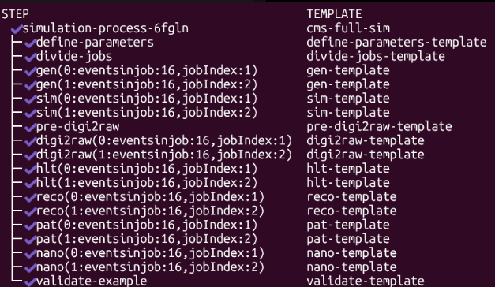

+++
title = "First Run"
weight = 20
teaching = 10
exercises = 15
questions = ["How to make the workflow run first with fewer events?", "What preparations are needed before the run?"]
objectives = ["Run a succesful workflow with a small number of events.", "Understand what is needed from the user in the workflow."]
keypoints = ["Before the workflow you have to upload file(s) to the object storage, with which the workflow starts the processing.", "The workflow can be started with `argo submit -n argo` and monitored with `argo get @latest -n argo`"]
+++


First, complete the [Setup]() to get an Infomaniak Kubernetes cluster and Argo installed on it.



## 1. Upload input files

The workflow can start from two starting points, either generate events from a data fragment, or if you have already done the LHE GEN step, you can start from the root files from that step and go straight to the SIM step.




Depending on if you want to create your own dataset or, for example, duplicate some set on the [Open Data Portal](https://opendata.cern.ch) you either write your own fragment or get an existing one from the internet.

If you want to get a fragments file from the Open Data Portal, choose your dataset and go to the GEN steps production script. There should be a `curl` command, e.g.

<!--Screenshots how to find fragment curl command-->

```bash
curl -s -k https://cms-pdmv-prod.web.cern.ch/mcm/public/restapi/requests/get_fragment/XXX-RunXXXXXX-YYYYY --retry 3 --create-dirs -o Configuration/GenProduction/python/XXX-RunXXXXXX-YYYYY-fragment.py
[ -s Configuration/GenProduction/python/XXX-RunXXXXXX-YYYYY-fragment.py ]
```

Once the fragments file is in your working directory, copy it to the cloud's object storage. You should be familiar with Infomaniak object storage after the [Setup](https://cms-opendata-workshop.github.io/tutorial-lesson-cloud-processing-infomaniak/)

```bash
openstack object create your_storage XXX-RunXXXXXX-YYYYY-fragment.py --name FullSim/my-dataset/XXX-RunXXXXXX-YYYYY-fragment.py
```




LHE is the Les Houches standard event format for the event generation. If you want to use the LHE format, you should do the event generation before running the workflow. Then your workflow will skip the GEN step and go directly to SIM using the files you provide from the event generation.

More information about event generation for the LHE format [here](https://fnallpc.github.io/generators/aio/index.html) or by reading the production scripts of the LHE GEN step of a simulated dataset in the [Open Data portal](https://opendata.cern.ch).

The event generation produces root files, which you have to copy to the object storage. Let's say, the root files are in your working directory in a folder called `LHEGEN`.

```bash
swift upload your_storage GEN/ --object-name FullSim/my-dataset/GEN/
```





If the `openstack` and `swift` commands are not working, check if you installed openstack tools in a Python virtual environment in the [Setup]().

```bash
source venv/bin/activate
pip install python-openstackclient python-swiftclient
# now run the swift command
```

Also make sure that you have authenticated for the OpenStack access by running
```bash
source PCP-XXXXXXX-openrc.sh
```



## 2. Edit the parameters

As said in the introduction, the `cms-simulation-process/run-pp-simulation.yaml` file includes some parameters that need to be updated to each user's situation. Open the yaml file with your preferred editor and edit the commented parameters.

```yaml
  arguments:
    parameters:
      ### EDIT BELOW: replace the placeholder 'yourstorage' with your object storage name
      - name: bucket
        value: yourstorage
      - name: dataName
        value: "my-dataset"
      ### EDIT BELOW: replace the placeholder 'fragments.py' with the file name of your fragment
      - name: fragFileName
        value: "fragments.py"
      ### EDIT BELOW: replace the placeholder '10' with the amount of events you want to process
      - name: totEvents
        value: 10
      ### EDIT BELOW: replace the placeholder '1' with 4 times the amount of nodes on your cluster e.g. 4 times 2 nodes --> nJobs is 8
      - name: nJobs
        value: 1
      ### EDIT BELOW: replace the placeholder '2016' with the year of the run you are simulating
      - name: runYear
        value: "2016"
```


If you want to use the LHE format in the event generation, you should do it before the workflow with resources you have available. Les Houches event generation is not included in this tutorial. Because the event generation is done elsewhere, for these situations, the boolean `startFromSim` should be set to true.


```yaml
      ### EDIT BELOW: If you have already completed the LHE GEN step change the boolean to true
      - name: startFromSim
        value: "false"
```

## 3. Create a storage volume for the workflow

The workflow uses two kinds of cloud storage

- Object Storage

Permanent storage for the input and output files of the storage. Remain even if the processing cluster is killed. This storage container is easily accessed through a web interface and command line and makes uploading and downloading files simple.

You created an object storage in the [Setup]() first step.

- Block Storage

The workflow needs a persistent volume, where it saves files from the intermediate steps. This is not a part of the processing nodes disk space. Therefore it is possible to simulate large datasets and save multiple gigabytes of files during the workflow without filling the disk space of the node itself.

Create a volume with OpenStack

```bash
openstack volume create --description "Volume for simulation workflow steps" --size 50 my_volume
```

After the volume is created, the command will print information about the volume in the terminal. Copy and save the id.

In the workflow repository's file `persistent_volume.yaml` replace the place holder with your id:

```yaml
csi:
    driver: cinder.csi.openstack.org
    ## EDIT BELOW: replace the placeholder 'xxxxxxxx-xxxx-xxxx' with your volumes UUID
    volumeHandle: xxxxxxxx-xxxx-xxxx
```

Apply the volume configurations to your cluster:

```bash
kubectl apply -f persistent_volume.yaml
kubectl apply -f persistent_volume_claim.yaml
kubectl apply -f nfs.yaml
```


## 4. Submit the workflow

Deploy the workflow to the cluster by running

```bash
cd /path/to/FullSimulationArgoWorkflow
argo submit -n argo cms-simulation-process/run-pp-simulation.yaml
```

Inspect the workflow status with

```bash
argo get @latest -n argo
```

During the first run, the PodInitializing might take a long time, because this is the first time the container images are pulled to the cluster's nodes.

Once the workflow has run, the output of `argo get @latest -n argo` will look something like this: 


## 5. After the workflow

After a succesful run, always remember to delete the block storage volume. This is discussed in more detail in the [Computing Resources]() chapter, but the volumes have a passive cost. This is why you should delete volumes whenever you are not using them. Especially when they are quite large in size.

First disable all the processes using the workflow
```bash
argo delete @latest -n argo
kubectl delete pvc workflow-pvc -n argo
kubectl delete pv workflow-pv
```

Now the volume is ready for deleting.
```bash
openstack volume delete my_volume
```

You can check that the volume doesn't exist anymore by running all of these:
```bash
kubectl get pv
kubectl get pvc -n argo
openstack volume list
```