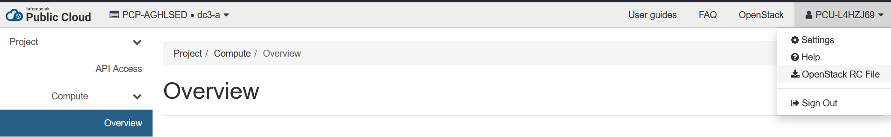
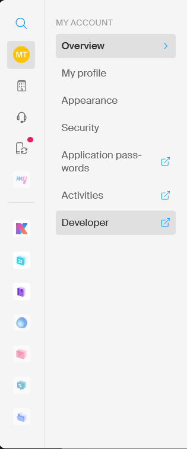
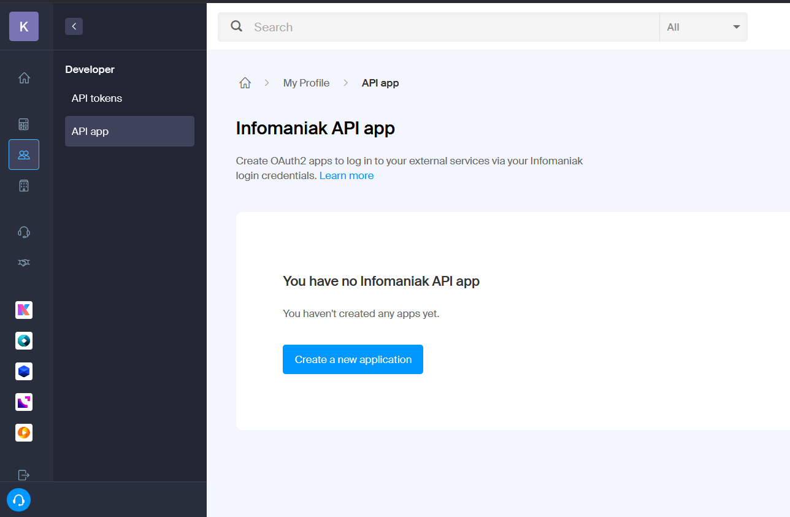
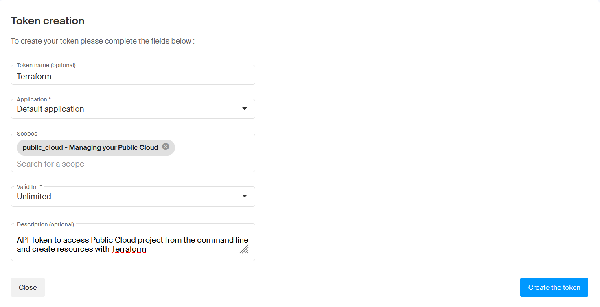

+++
title = "Get Started"
weight = 10
+++



In this tutorial we assume you are using a Linux shell, either on native Linux, Unix terminal or on Windows by using the WSL2



### 1. Create an Infomaniak account with a Public Cloud project

##### Infomaniak account

Create an Infomaniak account on their [website](https://www.infomaniak.com/en) from the "Get started for free" button.

Once registered, you can order a Public Cloud. This contains a certain amount of free credits, approximately 300 EUR, which can be used to create different cloud resources.




- Go to the [Manager Interface](https://manager.infomaniak.com).
- From the sidebar navigate to Cloud Computing > Public Cloud and click on "Order".
- Give your information in the form and send the order.

The form will ask for your credit card information. If you stay in the limits of the free tokens and free resources, this card will not be billed.

Once the Public Cloud is created, add a project:
- From the sidebar navigate to Cloud Computing > Public Cloud.
- In the list, click on the Public Cloud you just ordered.
- Scroll down and click on "Create a project".
- You are asked to create an OpenStack Access for this project. Make sure the password is not the same as any of your personal passwords, since it will be used in config files etc.

##### OpenStack Access

Now that the project is created, there is a new OpenStack Access in the project. Next, install the credentials onto your device to be able to access OpenStack from your terminal.

In the Manager interface, while you are in the Public Cloud project you just created, scroll down to see the list of OpenStack Accesses. Save the username of the OpenStack Access, starting with PCU-XXXXXX




If you are part of a group and want to use the same Infomaniak Public Cloud project, you only need to create an account and ask your project manager to add this account to their organisation.

As organisation owner you have to both invite the new user and grant them access to the Public Cloud:

- Go to the [Manager Interface](https://manager.infomaniak.com)
- From the sidebar navigate to Users and Profile > Users and click on "Add a user".
- Give your new user's information and send the invite.
- The new user has to accept the invite and create their Infomaniak account, if not already registered.

- Once the new user shows up in the User management list, click on the three dots next to the name and select "Modify product accesses".
- Under the Product administration title, give both technical and statistical rights to your Public Cloud to this user.

##### OpenStack Access

When you got access to the organisations Public Cloud and the projects in it, you can add your own OpenStack Access.

- Go to the [Manager Interface](https://manager.infomaniak.com).
- From the sidebar navigate to Cloud Computing > Public Cloud.
- In the Public Cloud list click on your Public Cloud and in the next list click on your project.
- In this view scroll down to see the list of OpenStack Accesses and click on "Add an access".
- Create the credentials and make sure this is not the same as any of your personal passwords, since it will be used in config files etc.
- When the new access shows up on the list of OpenStack Accesses, save the username, which starts with PCU-XXXXXX.




Install the credentials from another dashboard:
- Go to [Horizon](https://api.pub2.infomaniak.cloud/horizon/project/).
- Sign in with your OpenStack Access with the username you saved from the Manager interface and the password you just created.
- In the upper right corner click on your account information and there the "OpenStack RC file".
- This will download the credentials file onto your device.



### 2. Install the command line tools

##### Kubectl

Install `kubectl` command line tool using [these instructions](https://kubernetes.io/docs/tasks/tools/install-kubectl-linux/#install-using-native-package-management)


##### Argo Workflows CLI

Argo workflows is a command line tool used to submit and manage the workflows. Install it using [these instructions](https://github.com/argoproj/argo-workflows/releases/)

### 3. Clone the workflow repository

Clone the GitHub repository for this workflow:

```bash
git clone https://github.com/cms-opendata-processing-tasks/FullSimulationArgoWorkflow.git
cd FullSimulationArgoWorkflow
```
The directory, in which you copied the Git repository, is called the working directory from now on.


### 4. Enable OpenStack and create an Object Storage

Move the OpenRC file that you downloaded from the Manager Interface to the working directory:

```bash
mv <path-to-download>/PCU-XXXXXXX-openrc.sh <path-to-working-dir>
```

While working with the OpenStack cloud storages, two command line tools are used, Swift and OpenStack.


In most cases, the system wide Python environment is more complicated than installing the necessary packages into a virtual environment.

If you want to use Python in a virtual environment in this project, run in the working directory:
```bash
python3 -m venv venv
source venv/bin/activate
```
This activates the Python venv. If you want to exit, just run `deactivate`.


Install the command line tools with pip:

```bash
pip install python-openstackclient python-swiftclient
```

Now you can authenticate to your OpenStack area by running the OpenRC file:

```bash
source PCU-XXXXXXX-openrc.sh
```

This command prompts for your OpenStack password. After that you can create your Object Storage container:

```bash
openstack container create mystorage
```

The Object Storage has a passive cost, but only for the files you store in them. This is one of the differences between Object Storage and Block Storage volumes that you will create in the following chapters.

The workflow will be able to write to the Object Storage by using s3 credentials. Create them next by running:

```bash
openstack ec2 credentials create
```

Save the output in `access` and `secret` fields. You will need them once you have a cluster.


### 5. Order a cluster for testing

The cluster can be created one of two ways:

- Using Terraform from command line
- Using the Infomaniak web interface




#### Install Terraform
To install Terraform, follow [these instructions](https://developer.hashicorp.com/terraform/install)


In order to order a cluster from the command line the Terraform script uses an API Token to authenticate to the Public Cloud project. This API Token must be generated by a user with admin privileges to the project. Otherwise the `terraform apply` cannot run.

If getting admin privileges is not possible, choose the Web Interface method for ordering a cluster.


#### main.tf
In the GitHub repository there is a file called `main.tf`, which contains the cluster creating logic.

The part of the file, that defines the cluster, looks like this:

```terraform
resource "infomaniak_kaas" "cluster" {
    public_cloud_id             = 12345 # TODO: changeme
    public_cloud_project_id     = 67890 # TODO: changeme
    name                        = "my-cluster"
    pack_name                   = "dedicated_4" # class of the control plane 
    kubernetes_version          = "1.33"
    region                      = "dc3-a"
}

resource "infomaniak_kaas_instance_pool" "workers" {
    public_cloud_id             = infomaniak_kaas.cluster.public_cloud_id
    public_cloud_project_id     = infomaniak_kaas.cluster.public_cloud_project_id
    kaas_id                     = infomaniak_kaas.cluster.id
    name                        = "worker-pool"
    flavor_name                 = "a4-ram16-disk80-perf1" # type of the node, e.g. a4-ram16-disk80-perf1 is a node with 4 vCPU, 16GB RAM, 80GB disk and normal performance
    availability_zone           = "dc3-a-04"
    min_instances               = 2 # two nodes is enough for the testing cluster
    max_instances               = 2
}
```

The same Terraform file orders also volumes. The amount of volumes should match the amount of nodes on your cluster. For example with two worker nodes, you should order two volumes:

```terraform
resource "openstack_blockstorage_volume_v3" "volume1" {
    name              = "volume_1"
    description       = "Volume for computing node 1"
    size              = 15
    availability_zone = "nova"
}

resource "openstack_blockstorage_volume_v3" "volume2" {
    name              = "volume_2"
    description       = "Volume for computing node 2"
    size              = 15
    availability_zone = "nova"
}
```

In the Infomaniak [Manager Interface](https://manager.infomaniak.com) navigate to Cloud Computing > your Public Cloud > your project.

Under the title "Information" copy the "ID Public Cloud" and "ID Project". Insert their values to the `main.tf` in the `infomaniak_kaas.cluster` resource. 

#### API Token
For Terraform to be able to edit your Infomaniak resources, it needs an API Token.

- Go to the Infomaniak [Manager Interface](https://manager.infomaniak.com)

- Click on the Settings icon in the upper right corner


- Select Developer, which will open a new tab with the Developer Settings



- From the sidebar choose API Tokens



- Create a token: give at least the scope public_cloud 



When token is created, it is shown only once. Copy it and set it as environment variable in your terminal

```bash
export INFOMANIAK_TOKEN="<your_api_token>"
```

#### Order the cluster


```bash
terraform init
terraform plan
```

Terraform will print out what it is about to do. E.g. 
```bash
Terraform used the selected providers to generate the following execution plan. Resource actions are indicated with the following symbols:
  + create

Terraform will perform the following actions:

  # infomaniak_kaas.cluster will be created
  + resource "infomaniak_kaas" "cluster" {
      + id                      = (known after apply)
      + kubeconfig              = (sensitive value)
      + kubernetes_version      = "1.33"
      + name                    = "my-cluster"
      + pack_name               = "dedicated_4"
      + public_cloud_id         = 17701
      + public_cloud_project_id = 39034
      + region                  = "dc3-a"
    }

  # infomaniak_kaas_instance_pool.workers will be created
  + resource "infomaniak_kaas_instance_pool" "workers" {
      + availability_zone       = "dc3-a-04"
      + flavor_name             = "a4-ram16-disk80-perf1"
      + id                      = (known after apply)
      + kaas_id                 = (known after apply)
      + max_instances           = 2
      + min_instances           = 2
      + name                    = "worker-pool"
      + public_cloud_id         = 12345
      + public_cloud_project_id = 67890
    }

...

Plan: 4 to add, 0 to change, 0 to destroy.
```

Implement the plan by running
```bash
terraform apply
```

The creating of the cluster can take a while, but the terminal window, where the `terraform apply` is running, should remain open for the entire process. Otherwise the process might get corrupted.

Once it's done, extract your cluster's kubeconfig file to the working directory:
```bash
terraform output -raw kubeconfig > ./kubeconfig
```




### Order the cluster

1. Go to the [Infomaniak Dashboard](https://manager.infomaniak.com).

2. Navigate to Cloud Computing > Kubernetes.

3. Click Create a Kubernetes Cluster and choose your Public Cloud product and project from the dropdown menu.

4. From the available Control Planes choose "Cluster Dedicated 4" and continue.

5. Name your cluster, leave other fields as the default and order the cluster.

This might take some time, but in the meanwhile, you can order an instance pool.

6. In the Cloud Computing > Kubernetes click on the cluster that you ordered.
7. Scroll down to the instances and click on "Add a group of instances"
8. Name your group, leave the availability zone default if you don't have a preference and continue to selecting the nodes.
9. Filter only the nodes that have 4 vCPU, 16 GB of RAM and 80 GB of disk space. The workflow has been tested on specifically these kinds of nodes. More information in the Computing Resources chapter.
10. Choose the lower performance Perf1 node and click "Next".
11. Choose the Manual instance management and order two instances. Finally, confirm and wait for the cluster to spin up.





### The cluster order can take a while

Once the cluster is ordered, it can take a long time, anywhere from 20 minutes up to 2 hours, for it to be available. 

While waiting you can proceed to the [Introduction]() and the setting up will continue after that.
